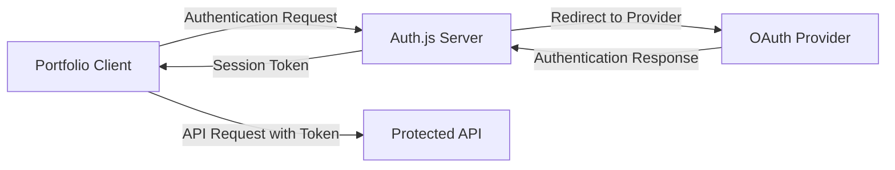

# Introduction

Welcome to the documentation for the Auth.js integration in your portfolio application. This guide will help you understand how authentication is implemented and how to use it in your project.

## What is Auth.js?

[Auth.js](https://authjs.dev/) (formerly NextAuth.js) is a complete open-source authentication solution for web applications. It provides a simple, flexible way to add authentication to your application with support for various authentication providers.

## Features

- **Multiple Authentication Providers**: Support for OAuth providers like GitHub, Google, Auth0, Facebook, and Keycloak
- **Secure by Default**: Uses JWT tokens with secure HTTP-only cookies
- **Customizable**: Easily customize the authentication flow and UI
- **TypeScript Support**: Full TypeScript support for type safety
- **Testing Utilities**: Tools for testing authentication in your application

## Architecture

The authentication system in your portfolio application consists of two main parts:

1. **Auth.js Server**: A Next.js application that handles authentication requests and manages sessions
2. **Portfolio Client**: Your React application that integrates with the Auth.js server

Here's a diagram of how they interact:



## Getting Started

To use authentication in your portfolio application, you need to:

1. **Set up environment variables** in `.env.local`
2. **Start the Auth.js server** on port 3000
3. **Configure your portfolio client** to use the Auth.js server

### Environment Variables

Create a `.env.local` file in the root of your project with the following variables:

```
# Auth.js server URL
REACT_APP_AUTH_SERVER_URL=http://localhost:3000

# Client URL (your React app)
REACT_APP_CLIENT_URL=http://localhost:3775

# OAuth Client IDs
REACT_APP_GITHUB_CLIENT_ID=your-github-client-id
REACT_APP_GOOGLE_CLIENT_ID=your-google-client-id
```

### Starting the Auth.js Server

```bash
# In the Auth.js server directory
npm run dev
```

### Using Authentication in Your Client

```javascript
import { signIn, signOut, useSession } from '@/components/auth/AuthJsClient';

// Sign in with a provider
signIn('github');

// Sign out
signOut();

// Get the current session
const session = useSession();
if (session) {
  console.log('Signed in as:', session.user.email);
}
```

## Next Steps

Explore the following sections to learn more about authentication in your portfolio application:

- [Authentication Providers](/providers): Learn about the available authentication providers
- [Auth.js Endpoints](/endpoints): Understand the API endpoints provided by Auth.js
- [Testing Authentication](/testing): Learn how to test authentication in your application
